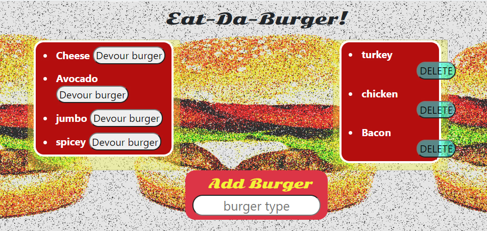

# Burger-Logger

- Eat-Da-Burger! is a restaurant app that lets users input the names of burgers they'd like to eat.
- Whenever a user submits a burger's name, the burger is displayed on the left side of the page -- waiting to be devoured.
- Each burger in the waiting area also has a `Devour it!` button. When the user clicks it, the burger will move to the right side of the page.
- Every burger is stored in a database, whether devoured or not.

## Technologies used:

- Javascript
- Handlebars
- Node.js
- MySQL
- Express
- CSS
- Photoshop

## Deployed on Heroku: https://order-burgers-log.herokuapp.com/
